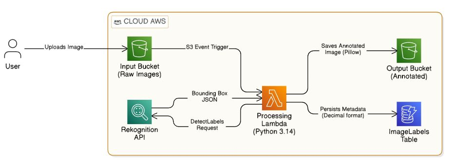
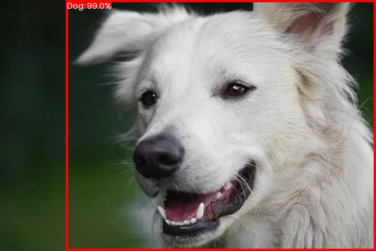

# 🚀 Serverless AI Image Labeling Pipeline

A production-ready, event-driven cloud pipeline that automatically detects objects in images, annotates them with high-contrast bounding boxes, and indexes metadata for search. Built with **Python 3.14** and **AWS**.

---

## 📌 Project Overview
This project automates image metadata extraction and visual annotation. When a user uploads a raw image to a source S3 bucket, a Lambda function is triggered to:
1. **Analyze** the image using **Amazon Rekognition**.
2. **Annotate** the image with pixel-perfect bounding boxes using **Pillow**.
3. **Persist** sanitized metadata in **Amazon DynamoDB**.
4. **Notify** the developer via **Amazon SNS** if any processing errors occur.

### 🏗️ Architecture

1. **Trigger:** S3 Bucket (`s3:ObjectCreated:*` event).
2. **Compute:** AWS Lambda (Python 3.14).
3. **AI Service:** Amazon Rekognition (Object & Instance Detection).
4. **Processing:** Pillow (PIL) for dynamic image annotation.
5. **Database:** Amazon DynamoDB (NoSQL) for metadata persistence.
6. **Monitoring:** Amazon SNS for real-time error alerting.

---

## 🛠️ Tech Stack
* **Language:** Python 3.14
* **Cloud Provider:** Amazon Web Services (AWS)
* **SDK:** Boto3
* **Libraries:** Pillow (PIL), Decimal, IO, JSON, OS.

---

## 🚀 Key Features
* **Event-Driven & Scalable:** Zero server management; scales instantly with upload volume.
* **Decoupled Configuration:** Utilizes **AWS Environment Variables** for resource ARNs, ensuring the codebase is portable and secure across different deployment stages.
* **Smart Annotation:** Dynamically scales font sizes and bounding boxes based on image resolution.
* **Data Integrity:** Implemented a recursive `float_to_decimal` helper to handle AWS Rekognition's float outputs for DynamoDB compatibility.
* **Observability:** Integrated `try-except` blocks with **SNS** publishing for instant "Pipeline Failure" alerts.

---

## 📦 Infrastructure & Dependencies

### AWS Lambda Layers
Since **Pillow** is not part of the standard Python runtime in AWS Lambda, it was implemented using a custom Lambda Layer to keep the deployment package lightweight.

**Layer Configuration:**
* **Library:** Pillow (PIL)
* **Pillow Layer ARN:** `arn:aws:lambda:us-east-1:770693421928:layer:Klayers-p312-Pillow:2` 

---

## 🔐 IAM Permissions & Security
The Lambda Execution Role follows the **Principle of Least Privilege** with the following permissions:

* **S3:** `s3:GetObject` (Source), `s3:PutObject` (Output).
* **Rekognition:** `rekognition:DetectLabels` (AI Analysis).
* **DynamoDB:** `dynamodb:PutItem` (Metadata Storage).
* **SNS:** `sns:Publish` (Error Notifications).

---

## 🔧 Setup & Environment Variables
To run this project, configure the following **Environment Variables** in your Lambda function:

| Key | Description |
| :--- | :--- |
| `OUTPUT_BUCKET` | The name of your destination S3 bucket for annotated images. |
| `SNS_TOPIC_ARN` | The ARN of your Amazon SNS Topic for error alerts. |
| `DYNAMODB_TABLE` | The name of your DynamoDB table (Default: `ImageLabels`). |

---

## 📸 Demo
| Raw Input (S3) | AI Annotated Output (S3) |
| :--- | :--- |
|  |  |

---

## 👨‍💻 Author
**Sofiene**
* 🎓 Software Engineering (MedTech) & BBA (HEC Montréal)
* ☁️ AWS Certified Cloud Practitioner
* 📍 Montréal, QC